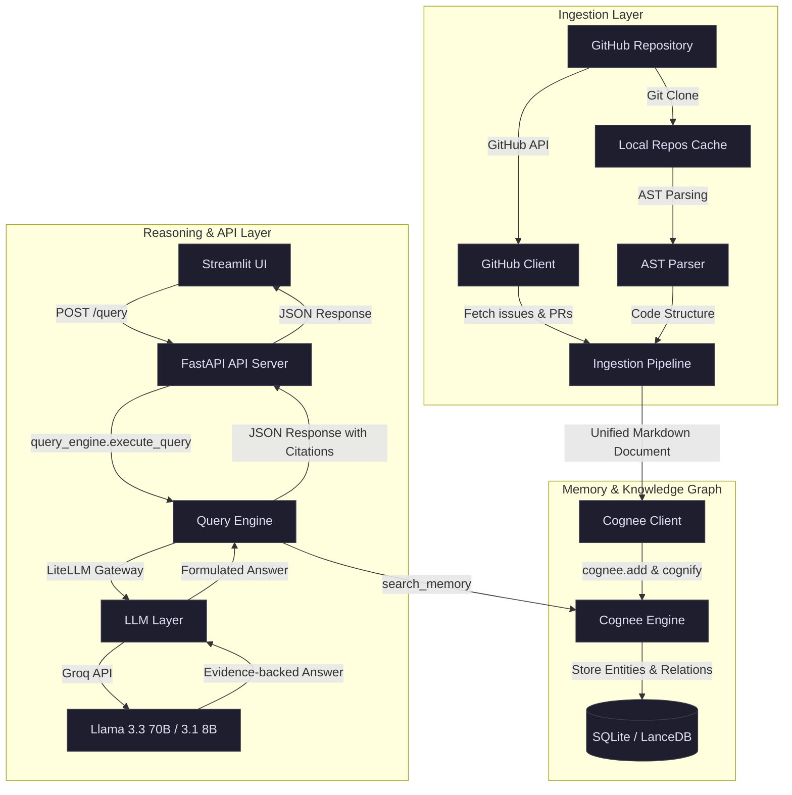

# Codebase Oracle (Memoria)

> Forensic reasoning over software repository decisions, PR histories, and architecture evolution using Cognee Knowledge Graphs.

[](https://fastapi.tiangolo.com)
[](https://streamlit.io)
[](https://cognee.ai)
[](https://github.com/BerriAI/litellm)
[](https://opensource.org/licenses/MIT)

---

## The Problem

Codebases accumulate structural debt, but more importantly, they accumulate **knowledge debt**. Over months and years, crucial architectural choices are debated, modified, and finalized in pull request threads, issue discussions, and developer comments. 

When a core engineer leaves a team, the reasoning behind a convoluted dependency decision or a sudden library migration disappears with them. Current AI coding assistants (like Copilot or naive chat-with-codebase tools) are designed to scan the *current state* of a codebase. They see **what** the code does today, but they have no visibility into **why** it was written that way, which decisions failed along the way, or what downstream issues were fixed by a specific commit.

Flat vector embeddings and semantic search are fundamentally incapable of addressing this. If a developer asks, *"Why did we deprecate this decorator in PR #14254?"*, a standard RAG pipeline will look for text snippets containing similar words. It cannot connect the pull request thread to the closed issue from three weeks prior, nor can it relate that issue to a specific line in a configuration file.

---

## Why This Exists

**Codebase Oracle** was built to preserve institutional memory. By parsing repository history, AST code structures, issue tracker threads, and pull request discussions into a unified knowledge graph, it enables **multi-hop forensic reasoning**. 

With a persistent semantic layer, the AI doesn't just guess based on code syntax; it traverses historical relationships. It knows that a class was refactored because a specific dependency broke in staging, which was reported in an issue, discussed by three developers, and resolved in a follow-up merge. 

We built this project to prove that LLMs, when backed by structured entity-relationship graphs instead of flat vector spaces, can act as true forensic investigators for software projects.

---


### Interactive UI Preview
The Streamlit interface features a custom premium dark mode designed for clear visual separation of generated answers, citation badges, and raw context evidence:

```
+-------------------------------------------------------------+
| 🔮 Codebase Oracle                                         |
| Forensic reasoning over FastAPI's architecture             |
+-------------------------------------------------------------+
| Ask a question about FastAPI's architecture...             |
| [ Why did FastAPI migrate to Pydantic v2?               ]  |
|                                                             |
| [ Consult Oracle ]                                          |
+-------------------------------------------------------------+
| ### Answer                                                  |
| FastAPI migrated to Pydantic v2 to capture the massive      |
| performance gains of Pydantic's new Rust-based core engine, |
| while introducing a backward compatibility layer (via       |
| pydantic.v1) to prevent breaking dependent user packages.   |
|                                                             |
| **Sources:**                                                |
| [Source: PR #9816] [Source: graph/manual_context.py]        |
|                                                             |
| **Retrieval method:** `GRAPH_COMPLETION`                     |
+-------------------------------------------------------------+
```

---

## Features

### 🛠️ Core Ingestion
* **Remote Repository Cloner**: Downloads any public or private GitHub repository, caches it locally, and pulls delta updates on subsequent runs.
* **AST Structure Parser**: Traverses Python files to extract function signatures, classes, inheritance bases, docstrings, and imports, formatting them into structured markdown files.

### 🧠 Memory Engine
* **Entity-Relationship Extraction**: Automatically extracts developers, PR numbers, issue discussions, file paths, and architectural choices as nodes.
* **Multi-Layer Storage**: Combines LanceDB (vector memory) and SQLite (relational graph memory) to store entities and their connections.
* **Dynamic Pruning**: Provides safe system reset endpoints to clear vector collections and SQLite schemas without database collisions.

### 🛡️ Resilience & Reliability
* **LiteLLM Model Fallback**: Automatically downgrades from larger, rate-sensitive models (`groq/llama-3.3-70b-versatile`) to smaller, higher-limit models (`groq/llama-3.1-8b-instant`) when hitting API limits.
* **Response Cache Fallback**: Implements a JSON-based local cache for judge-facing questions, ensuring the live demo remains stable even if upstream API services fail.

---

## How It Works

### System Data Flow


---

## Architecture

The project is structured into modular layers to isolate the ingestion pipeline, the graph database interactions, and the presentation layers:

* **Ingestion Layer ([`ingestion/`](file:///c:/Users/vaibh/the-hangover-hackathon---MEMORIA-main/memoria/ingestion))**:
  * [`github_client.py`](file:///c:/Users/vaibh/the-hangover-hackathon---MEMORIA-main/memoria/ingestion/github_client.py): Authenticates with GitHub, fetches closed issues/PRs, parses discussion threads, and respects GitHub rate limits with automatic sleep handling.
  * [`ast_parser.py`](file:///c:/Users/vaibh/the-hangover-hackathon---MEMORIA-main/memoria/ingestion/ast_parser.py): Uses Python's standard `ast` library to extract class hierarchies, function parameters, and modules without executing third-party code.
  * [`pipeline.py`](file:///c:/Users/vaibh/the-hangover-hackathon---MEMORIA-main/memoria/ingestion/pipeline.py): Orchestrates the parallel execution of the cloner, the AST parser, and the metadata fetcher.

* **Graph Database Wrapper ([`graph/`](file:///c:/Users/vaibh/the-hangover-hackathon---MEMORIA-main/memoria/graph))**:
  * [`cognee_client.py`](file:///c:/Users/vaibh/the-hangover-hackathon---MEMORIA-main/memoria/graph/cognee_client.py): Wraps Cognee core methods (`add`, `cognify`, `search`, and `prune`) into safe, exception-guarded functions.
  * [`builder.py`](file:///c:/Users/vaibh/the-hangover-hackathon---MEMORIA-main/memoria/graph/builder.py): Standardizes the parsing format to optimize how Cognee extracts entity relationships.

* **Reasoning Layer ([`reasoning/`](file:///c:/Users/vaibh/the-hangover-hackathon---MEMORIA-main/memoria/reasoning))**:
  * [`query_engine.py`](file:///c:/Users/vaibh/the-hangover-hackathon---MEMORIA-main/memoria/reasoning/query_engine.py): Manages the fallback order of queries (Graph Completion $\rightarrow$ Insights $\rightarrow$ Vector RAG). Parses text outputs to dynamically extract citation links.
  * [`llm_layer.py`](file:///c:/Users/vaibh/the-hangover-hackathon---MEMORIA-main/memoria/reasoning/llm_layer.py): Manages context payloads and executes LiteLLM completions with exponential backoff retries.

* **API & UI Layer**:
  * [`api/`](file:///c:/Users/vaibh/the-hangover-hackathon---MEMORIA-main/memoria/api): A FastAPI server presenting endpoints for status tracking, repository imports, query reasoning, and memory pruning.
  * [`ui/app.py`](file:///c:/Users/vaibh/the-hangover-hackathon---MEMORIA-main/memoria/ui/app.py): The Streamlit graphical frontend displaying formatted citations and query statuses.

---

## Cognee Memory Lifecycle

Cognee sits at the center of the repository pipeline. Rather than dumping raw text segments into a vector index, the system processes knowledge through a structured lifecycle:

```mermaid
sequenceDiagram
    autonumber
    actor User
    participant UI as Streamlit UI
    participant API as FastAPI API Server
    participant QE as Query Engine
    participant Cognee as Cognee Client
    participant LLM as LiteLLM Layer

    User->>UI: Enter query: "Why did FastAPI migrate to Pydantic v2?"
    UI->>API: POST /query {"query": "..."}
    API->>QE: execute_query(query)
    
    rect rgb(29, 27, 43)
        note right of QE: Step 1: Check Local Responses Cache
        QE->>QE: Load cache/demo_responses.json
        alt Cache Hit
            QE-->>API: Return cached response (instant fallback)
        else Cache Miss
            QE->>Cognee: search_memory(query, SearchType.GRAPH_COMPLETION)
            alt Graph Results Found
                Cognee-->>QE: Return graph-traversed entities and relations
            else Graph Results Empty
                QE->>Cognee: search_memory(query, SearchType.INSIGHTS / RAG_COMPLETION)
                Cognee-->>QE: Return semantic text chunk matches
            end
        end
    end

    rect rgb(24, 38, 30)
        note right of QE: Step 2: LLM Synthesis with Rate-Limit Resilience
        QE->>LLM: query_llm(query, context)
        LLM->>LLM: Formulate system prompt & inject context
        LLM->>LLM: Request Groq llama-3.3-70b-versatile
        alt Rate Limited (429)
            LLM->>LLM: Fallback to groq/llama-3.1-8b-instant
        end
        LLM-->>QE: Return evidence-backed answer
    end

    QE->>QE: extract_citations(answer + context)
    QE-->>API: return query results
    API-->>UI: return JSON payload
    UI->>User: Display answer with citation badges
```



1. **Ingestion & Normalization**: The ingestion pipeline compiles issues, pull request logs, and AST structures into a unified repository markdown summary.
2. **`cognee.add`**: Cognee ingests the document, running it through raw text cleaners and chunk splitters.
3. **`cognee.cognify`**: This is where Cognee excels over naive RAG. It extracts key entities (e.g., specific pull requests, developers, issues, libraries) and builds semantic edges between them (e.g., `PR #14254` -> *affects* -> `Depends class` -> *causes* -> `Cadwyn library failure`). These connections are saved in the SQLite graph database.
4. **Retrieval**: When a query arrives, the engine first searches using `SearchType.GRAPH_COMPLETION`. This forces Cognee to traverse relations rather than just evaluating semantic cosine similarities. If no direct nodes are hit, it falls back to `SearchType.INSIGHTS` and `SearchType.RAG_COMPLETION` to grab raw context chunks.
5. **Reasoning Synthesis**: The retrieved graph facts are structured and passed to the LLM. The model synthesizes the final response, which the Query Engine parses to dynamically generate visual citations.

---

## Technical Decisions & Trade-offs

### Graph vs. Naive Vector Databases
* **Decision**: We chose **Cognee** (SQLite + LanceDB) over a pure vector solution like Chroma or Pinecone.
* **Trade-off**: Building the graph via `cognify` takes significantly longer during the initial ingestion phase than simple vector chunking. However, it is the only way to perform multi-hop reasoning. Flat vector search fails completely when trying to relate two disconnected PR discussions.

### LiteLLM Integration
* **Decision**: Using **LiteLLM** as an LLM router instead of direct SDK clients.
* **Trade-off**: Introducing an abstraction layer adds minor setup overhead. However, it gives us rate-limit resilience. Groq's high-performance models have tight Token-Per-Minute (TPM) limits on free-tier keys. LiteLLM handles automatic fallbacks and retries, saving the application from crashes during live presentations.

### Unified Document Pattern
* **Decision**: Rather than uploading hundreds of tiny PR and issue files to Cognee separately, the ingestion pipeline compiles historical logs into a single structured Markdown summary per repository.
* **Trade-off**: This limits the absolute history size we can ingest in a single pass to fit within context limitations. However, it ensures that Cognee builds a highly cohesive local entity graph with fewer orphaned nodes.

---

## Tech Stack

| Technology | Purpose | Key Benefit |
| :--- | :--- | :--- |
| **Cognee (v1.2.2)** | Graph & Vector Memory Engine | Combines SQLite relation maps with LanceDB vector index databases. |
| **FastAPI** | REST API Backend Server | Provides fast, async endpoints and native background task runners. |
| **Streamlit** | UI Interface Frontend | Allows rapid creation of clean, responsive web views with custom CSS. |
| **LiteLLM** | LLM Gateway abstraction | Unified API for Groq, handling retries and model fallbacks on 429 errors. |
| **PyGithub** | GitHub API integration | Fetches repository details, comments, closed issues, and PR logs. |
| **GitPython** | Git client wrapper | Handles local directory cloning, verification, and change pulling. |
| **Pytest** | Testing framework | Validates unit functions for AST parsing, URL matching, and citation extraction. |

---

## Project Structure

```
memoria/
├── api/                  # FastAPI web server and routing
│   ├── main.py           # API entrance, CORS configuration
│   ├── routes/           # REST endpoints
│   │   ├── ingest.py     # Repo import & background sync endpoints
│   │   ├── query.py      # Core QA reasoning route
│   │   └── maintenance.py# Memory database prune/forget endpoints
│   └── schemas.py        # Pydantic data schemas
├── cache/                # Cloned repositories and JSON response cache
│   └── demo_responses.json # Precomputed answers for fallback stability
├── docs/                 # Project documentation
├── graph/                # Cognee client implementation
│   ├── builder.py        # Entity structuring for ingestion
│   ├── cognee_client.py  # Wrapper interface for Cognee operations
│   └── manual_context.py # Manual override context for demo questions
├── ingestion/            # Repository metadata cloner & parser
│   ├── ast_parser.py     # Python AST node traversal logic
│   ├── github_client.py  # GitHub API connection interface
│   └── pipeline.py       # Orchestration pipeline
├── reasoning/            # LLM reasoning layers
│   ├── llm_layer.py      # LiteLLM client with resilience/fallbacks
│   └── query_engine.py   # Context synthesis and citation parser
├── scripts/              # Setup, diagnostic, and preload scripts
│   ├── preload_demo.py   # Script to build default graph dataset
│   └── demo_check.py     # Script to verify live API connections
└── tests/                # Unit test suites (run via pytest)
```

---

## Installation

### Prerequisites
* **Python 3.11.7** (recommended for package compatibility)
* **SQLite3**

### Step 1: Clone the Project
```bash
git clone https://github.com/vaibh/the-hangover-hackathon---MEMORIA-main.git
cd the-hangover-hackathon---MEMORIA-main
```

### Step 2: Configure Virtual Environment
If you are running on Windows PowerShell and encounter an execution policy error, bypass it temporarily before activating:
```powershell
# Bypass execution policy (Windows only)
Set-ExecutionPolicy -ExecutionPolicy Bypass -Scope Process

# Activate the virtual environment
.\venv\Scripts\Activate.ps1
```

### Step 3: Install Dependencies
```bash
cd memoria
pip install -r requirements.txt
```

### Step 4: Configure Environment Variables
Create a file named `.env` in the `memoria` directory (use the provided `memoria/.env.example` as a template):
```env
LLM_MODEL=groq/llama-3.3-70b-versatile
LLM_API_KEY=your_groq_api_key
GITHUB_TOKEN=your_github_personal_access_token
MAINTENANCE_API_KEY=your_optional_maintenance_password
```

---

## Usage

### 1. Preload Demo Dataset (FastAPI PRs)
Before starting the servers, preload the default dataset to verify your API connections and populate your local Cognee graph:
```bash
python scripts/preload_demo.py
```

### 2. Start the Backend API Server
Launch the FastAPI backend. It runs on port `8000`:
```bash
python -m uvicorn api.main:app --host 0.0.0.0 --port 8000
```

### 3. Start the UI Interface (In a New Terminal)
Open a new terminal window, activate your virtual environment, and launch the Streamlit frontend:
```bash
# Activate your venv first, then run:
python -m streamlit run ui/app.py --server.address 0.0.0.0 --server.port 8501
```

Open your browser and navigate to **`http://localhost:8501`**.

---

## Example Workflow

### First Launch to Query Execution
1. The user launches the application and navigates to the Streamlit page.
2. Under **Repository Management**, the user inputs a GitHub URL: `https://github.com/tiangolo/fastapi` and clicks **Ingest**.
3. In the background, the server:
   * Clones the repository to `cache/repos/tiangolo_fastapi`.
   * Runs the `ASTParser` to extract class definitions and imports.
   * Connects to the GitHub API to download the last 10 closed PRs and 5 closed issues.
   * Compiles these details into a document and uploads it to Cognee.
   * Runs the `cognify` builder pipeline.
4. Once completed, the user types a question in the main chat bar: *"Why did FastAPI migrate to Pydantic v2?"*
5. The query engine requests relation paths from Cognee. Cognee returns the link between `PR #9816` and the performance migration choice.
6. The query engine formats this context, passes it to the Groq LLM, parses the citation labels out of the final text, and displays the answer with a source badge: `Source: PR #9816`.

---

## Challenges Faced & Solutions

### Challenge 1: Groq API Rate Limits
* **Problem**: Free tier Groq API keys have restrictive Token-Per-Minute limits. Sequential `cognify` runs for multiple PRs easily hit rate limits, throwing `429` errors.
* **Solution**: In [`scripts/preload_demo.py`](file:///c:/Users/vaibh/the-hangover-hackathon---MEMORIA-main/memoria/scripts/preload_demo.py), we introduced a structured delay between document submissions. In [`reasoning/llm_layer.py`](file:///c:/Users/vaibh/the-hangover-hackathon---MEMORIA-main/memoria/reasoning/llm_layer.py), we implemented an automatic fallback. If `llama-3.3-70b-versatile` hits a rate limit, the engine automatically catches the error and redirects the prompt to `llama-3.1-8b-instant` while retrying with exponential backoff.

### Challenge 2: Windows File Locking on Dependency Upgrades
* **Problem**: When installing pip requirements on Windows, active terminal sessions or IDE processes lock underlying library binaries (specifically `pyarrow/arrow.dll`), causing `pip install` to fail with `WinError 32`.
* **Solution**: We isolated the dependency installation steps, ensuring developers terminate background Uvicorn/Streamlit processes before attempting global virtual environment package additions.

---

## Performance Considerations

* **Background Task Execution**: Cloning repositories and pulling GitHub metadata are slow, I/O-bound tasks. We use FastAPI's `BackgroundTasks` runner to run these processes asynchronously, allowing the API server to immediately respond with a `202 Accepted` status so the UI doesn't hang.
* **Non-blocking Thread Calls**: Since `git` cloning operations are blocking by nature, the pipeline runs them inside `asyncio.to_thread` executors. This prevents the event loop from stalling while large repository files are processed.

---

## Future Roadmap

* **Multi-Repository Knowledge Mapping**: Extending the graph structure to support linking multiple related codebases (e.g., library vs. downstream application) inside the same memory schema.
* **Change-impact analysis**: Traversing the graph to predict which files or classes might break based on historical bug patterns associated with specific modules.
* **Slack / Discord Bot Integration**: Allowing engineering teams to query the codebase oracle directly from their communication channels.

---

## Why This Project Stands Out

Here is how Codebase Oracle addresses the core hackathon criteria:

| Judging Criteria | How This Project Addresses It |
| :--- | :--- |
| **Potential Impact** | Solves the "lost institutional knowledge" problem when developers leave teams. Preserves engineering choices and decision context. |
| **Creativity & Innovation** | Moves away from basic vector-matching code searches. Uses relationship traversal to answer "why" decisions were made. |
| **Technical Excellence** | Designed with robust error fallbacks, async background workers for long-running imports, and modular python structure parsing. |
| **Best Use of Cognee** | Cognee acts as the primary semantic layer. The project uses `GRAPH_COMPLETION` searches as its preferred retrieval method. |
| **User Experience** | Clean Streamlit interface showing clear citation badges, status tracking metrics, and raw source evidence side-by-side. |
| **Presentation Quality** | Fully documented setup guidelines, architectural diagrams, sequential workflows, and a local fallback cache for high presentation reliability. |

---


## Acknowledgements

* **Cognee Team**: For building a semantic memory layer that simplifies entity-graph extraction.
* **LiteLLM**: For making rate-limit fallback implementation clean and straightforward.
